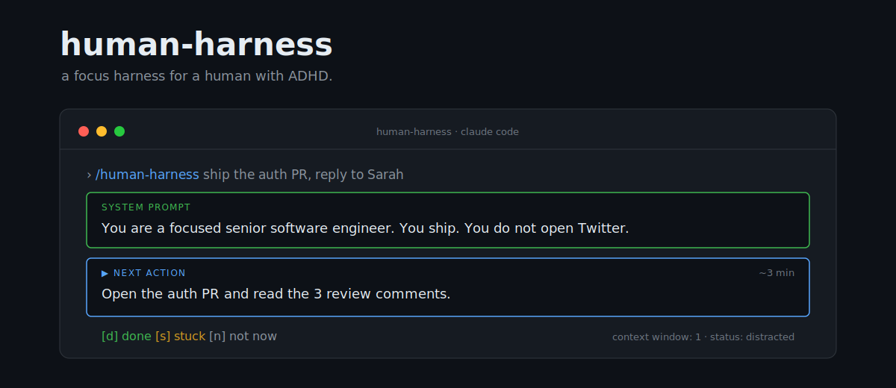

<p align="center">
  
</p>

<p align="center">
  
  
  
  
</p>

# human-harness

> Humans with ADHD are just LLMs with a terrible context window and no system prompt.
> So I gave myself one.

`human-harness` is a focus harness for a human with ADHD. It's the same scaffolding
I build to keep an LLM on task (one thing at a time, a system prompt, no wandering),
except it's pointed at you.

It runs inside [Claude Code](https://claude.com/claude-code) as a skill. You give it
a task; it casts you a system prompt, breaks the task into the single next physical
action, shows you **one thing at a time**, and when you drift it re-injects your
system prompt at you.

```
  ╔══════════════════════════════════════════════════════════════╗
  ║  SYSTEM PROMPT                                                 ║
  ║  You are a focused senior software engineer.                   ║
  ║  You ship. You do not open Twitter.                            ║
  ╚══════════════════════════════════════════════════════════════╝

  ┏━━━━━━━━━━━━━━━━━━━━━━━━━━━━━━━━━━━━━━━━━━━━━━━━━━━━━━━━━━━━━━━━┓
  ┃  ▶ NEXT ACTION                                                ┃
  ┃                                                               ┃
  ┃    Open PR #412. Read the 3 review comments, lines 40–90.     ┃
  ┃    ~3 min                                                     ┃
  ┗━━━━━━━━━━━━━━━━━━━━━━━━━━━━━━━━━━━━━━━━━━━━━━━━━━━━━━━━━━━━━━━━┛

  queued · do not load yet
    · fix null check L47, push          ~10m
    · reply re: extract helper          ~8m
    · re-request review                 ~1m

  off-limits
    · Twitter · unrelated refactors · any new task

  [d] done     [s] stuck     [n] not now
```

## Install (30 seconds)

It's a Claude Code skill — a single file, just like any other skill.

```bash
git clone https://github.com/dhasson04/human-harness
mkdir -p ~/.claude/skills/human-harness
cp human-harness/SKILL.md ~/.claude/skills/human-harness/SKILL.md
```

Restart Claude Code. That's it. No key, no config, nothing to connect.

## Use

```
/human-harness ship the auth PR and reply to Sarah
```

- It casts your **system prompt** (adapts to the task — `do my outreach` makes you a
  salesperson) and breaks the work into the single next physical action.
- Reply **`d`** when done → next action. **`s`** if stuck → it shrinks the step
  smaller. **`n`** for not now → it requeues, no guilt.
- Wander off-task and it re-injects your system prompt at you.

No arguments? It just asks: `> what do you want done?`

## Why it works (it's not (only) a joke)

The bit lands because it's true. The research on ADHD and task initiation is
unanimous on a few things, and the harness is built on exactly them:

- **Show one task, remove the "what next" decision.** Backlogs cause paralysis;
  a single next action defeats it.
- **Atomize for the user.** Breaking work into a ridiculously small next step is the
  top-recommended intervention — *and deciding that step is itself the hard part.*
  So the harness does it for you.
- **No shame.** The barrier to starting is accumulated guilt, not difficulty. The
  harness never counts your overdue tasks at you. It just hands you the next thing.

## License

MIT. You are the model. Go ship.
